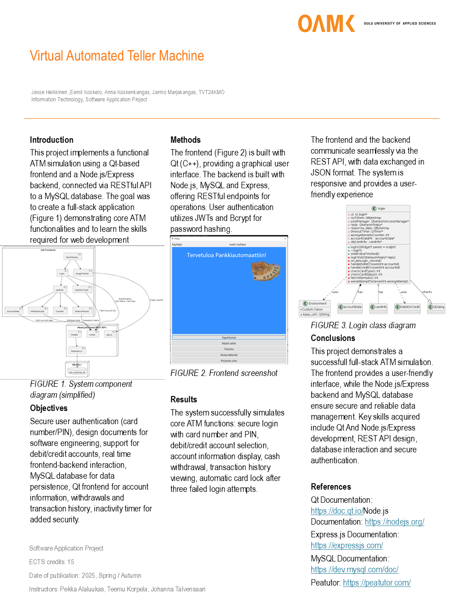

# Oulun ammattikorkeakoulun ohjelmistokehityksen sovellusprojekti

Tämä projekti on Oulun ammattikorkeakoulun tietotekniikan koulutusohjelman ohjelmistokehityksen sovellusprojektikurssille IN00ED14-3003 toteutettu **pankkiautomaattisovellus**. Kurssi oli 15 opintopisteen laajuinen.

## Projektin tavoitteet

- Toteuttaa toimiva sovellus projektisuunnitelman mukaan
- Soveltaa seuraavilla kursseilla opittuja taitoja käytännössä:
    - Olio-ohjelmointi ja oliopohjainen suunnittelu (5op)
    - Tietokannat ja rajapinnat (5op)
    - Linux Administration (5op)
- Työskennellä tehokkaasti tiimissä
- Oppia projektinhallintaa ja ohjelmistokehityksen parhaita käytäntöjä

## Projektiryhmä

Projektiryhmä koostuu seuraavista henkilöistä:

<table>
  <tbody>
    <tr>
      <td align="center" valign="top" width="20%"><a href="https://github.com/mintusmaximus"><br /><sub><b>Jesse Heikkinen</b></sub></a><br /><a href="https://github.com/tvt24kmo-project/group_15/commits/main/?author=mintusmaximus" title=""></a></td>
      <td align="center" valign="top" width="20%"><a href="https://github.com/eemil3"><br /><sub><b>Eemil Koskelo</b></sub></a><br /><a href="https://github.com/tvt24kmo-project/group_15/commits/main/?author=eemil3" title=""></a></td>
      <td align="center" valign="top" width="20%"><a href="https://github.com/nnksknkngs"><br /><sub><b>Anna Koskenkangas</b></sub></a><br /><a href="https://github.com/tvt24kmo-project/group_15/commits/main/?author=nnksknkngs" title=""></a></td>
      <td align="center" valign="top" width="20%"><a href="https://github.com/jarmoit"><br /><sub><b>Jarmo Marjakangas</b></sub></a><br /><a href="https://github.com/tvt24kmo-project/group_15/commits/main/?author=Jarmoit" title=""></a></td>
    </tr>
  </tbody>
</table>

## Ominaisuudet
- **Tietokanta:** Asiakas-, tili- ja korttitiedot tallennetaan MySQL-tietokantaan
- **REST API:** Node.js-pohjainen API mahdollistaa tietokannan ja Qt-sovelluksen välisen kommunikoinnin
- **Pankkiautomaattisovellus:** Qt-työpöytäsovellus, jossa käytetään QT Network -moduulia
- **Autentikaatio:** Suojaa kirjautumisen kortin numerolla ja PIN-koodilla, lukitsee kortin kolmesta väärästä yrityksestä
- **Debit/Credit tilit:** Tukee sekä debit ja credit tilejä ja kumman jomman valinnan
- **Tilitiedot:** Näyttää tilin tiedot (saldo, iban, luottoraja...)
- **Tapahtumahistoria:** Näyttää tilihistorian sivuttain
- **Epäaktiivisuuden timeri:** Automaattinen uloskirjautuminen epäaktiivisuuden jälkeen
- **Tietokannan varmuuskopio:** Ottaa dumpin tietokannasta joka päivä klo 03:00
- **CRUD Operaatiot:** Node.js APIin on ohjelmoitu CRUD operaatiot kaikille sovelluksen tauluille


## Teknologiastäkki
- **Frontend**
  - Qt Framework (C++)
  - Qt Network (QNetworkAccessManager, QNetworkRequest, QNetworkReply)
  - Qt Widgets (QDialog, QPushButton, QLabel ym.)
  - QJsonDocument, QJsonObject, QJsonArray JSON käsittelyyn
- **Backend**
  - Node.js
  - Express.js
  - MySQL (mysql2 kirjasto)
  - JWT (jsonwebtoken) autentikointia varten
  - bcrypt pin-koodin suojaamiseen
  - dotenv
- **Tietokanta**
  - MySQL
  

## Sovelluksen pyörittäminen paikallisesti:

### Esivaatimukset
* MySQL Server
* Node.js ja npm asennettu
* Qt Creator asennettu

### Backendin asennus

1. **Kloonaa repositorio:**
   ```bash
   git clone https://github.com/tvt24kmo-project/group_15.git
   ```
2. **Navigoi backend kansioon:**
   ```bash
   cd backend
   ```
3. **Luo tietokanta** (ohjeet MySQL Workbenchille)
   * Avaa MySQL Workbench (tai valitsemasi MySQL clientti)
   * Luo uusi schema nimeltä `atm_automat`
   * Importtaa MySQL dumppitiedosto:
     * Navigoi `Server -> Data Import`
     * Valitse `Import from Self-Contained File`
     * Valitse `/backend/FINAL_TESTINGACCOUNT.sql`
     * Valitse `atm_automat` importin kohteeksi (default target schema)
     * Importtaa dumppi
   * `/backend/sql/TESTINGACCOUNT_INFO.txt` tiedostossa on tietokannan dumpissa olevat kortit sekä käyttäjät ym.
4. **Luo `.env` tiedosto:**
    * Luo `.env` tiedosto `backend` kansioon
    * Kopioi `env_template` tiedoston tiedot `.env` tiedostoon
    * Täytä `.env` tiedoston kentät omilla MySQL yhteyden parametreillä
5. **Asenna riippuvuudet:**
   ```bash
   npm install
   ```
6. **Käynnistä palvelin:**
   ```bash
   npm start
   ```
   * Node.js palvelin testaa tietokannan yhteyttä käynnistettäessä

### Frontendin asennus
1. **Avaa projekti:**
   * Avaa .pro tiedosto `bank-automat` kansiosta Qt Creatorilla
2. **Konfiguroi projekti:**
   * Käytä Desktop Qt:ta projektin konfigurointiin ja paina `configure project`
     * esim. Desktop Qt 6.8.2 MinGW 64.bit
3. **Käynnistä sovellus:**
   * Buildaa projekti (ctrl+r)
     


Tietokannan ER-kaavio:


Sovelluksen englanninkielinen posteri:


## Lisenssi
Tämä projekti on lisensoitu MIT-lisenssillä. Lisätiedot [LICENSE](LICENSE)-tiedostosta.
