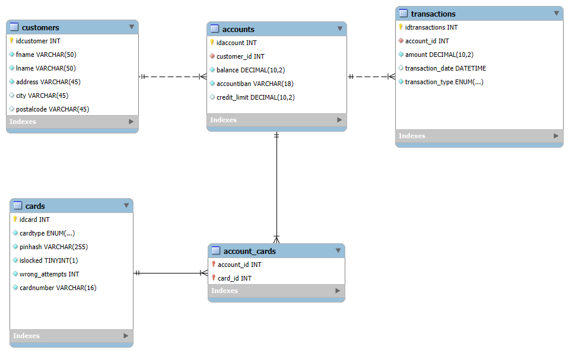

# Oulun ammattikorkeakoulun ohjelmistokehityksen sovellusprojekti

Tämä projekti on Oulun ammattikorkeakoulun tietotekniikan koulutusohjelman ohjelmistokehityksen sovellusprojektikurssille IN00ED14-3003 toteutettu **pankkiautomaattisovellus**. Kurssi oli 15 opintopisteen laajuinen.

## Projektin tavoitteet

- Toteuttaa toimiva sovellus projektisuunnitelman mukaan
- Soveltaa seuraavilla kursseilla opittuja taitoja käytännössä:
    - Johdatus ohjelmointiin (5op)
    - Olio-ohjelmointi ja oliopohjainen suunnittelu (5op)
    - Tietokannat ja rajapinnat (5op)
    - Linux Administration (5op)
- Työskennellä tehokkaasti tiimissä
- Oppia projektinhallintaa ja ohjelmistokehityksen parhaita käytäntöjä

## Projektiryhmä

Projektiryhmä koostuu seuraavista henkilöistä:

<table>
  <tbody>
    <tr>
      <td align="center" valign="top" width="20%"><a href="https://github.com/mintusmaximus"> <b>Jesse Heikkinen</b></a> </td>
      <td align="center" valign="top" width="20%"><a href="https://github.com/eemil3"> <b>Eemil Koskelo</b></a> </td>
      <td align="center" valign="top" width="20%"><a href="https://github.com/nnksknkngs"> <b>Anna Koskenkangas</b></a> </td>
      <td align="center" valign="top" width="20%"><a href="https://github.com/jarmoit"> <b>Jarmo Marjakangas</b></a> </td>
    </tr>
  </tbody>
</table>

## Ominaisuudet
- **Tietokanta:** Asiakas-, tili- ja korttitiedot tallennetaan MySQL-tietokantaan
- **REST API:** Node.js-pohjainen API mahdollistaa tietokannan ja Qt-sovelluksen välisen kommunikoinnin
- **Pankkiautomaattisovellus:** Qt-työpöytäsovellus, jossa käytetään QT Network -moduulia

## Tietokannan pyörittäminen paikallisesti:
- Kloonaa repositorio
- Avaa MySQL Workbench
- Luo uusi schema nimeltä `atm_automat`
- Importtaa MySQL dumppitiedosto valikosta `Server -> Data Import -> Import from Self-Contained File` 
- Valitse target schema jonka loit äsken
- Importtaa dumppi
- Luo `.env` tiedosto `/backend` kansioon
- Kopioi `env_template` tiedoston tiedot omaan `/backend/.env` tiedostoon
- Täytä `.env` tiedostoon omat MySQL yhteyden parametrit
- Avaa konsoli-ikkuna `/backend` kansioon
- Aja komento `npm install` ja `npm start`
- NodeJS Serveri testaa käynnistäessä yhteyttä tietokantaan

Tietokannan ER-kaavio:

## Lisenssi
Tämä projekti on lisensoitu MIT-lisenssillä. Lisätiedot [LICENSE](LICENSE)-tiedostosta.